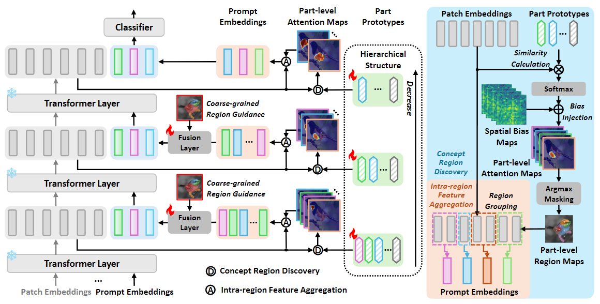
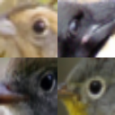
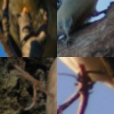
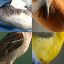
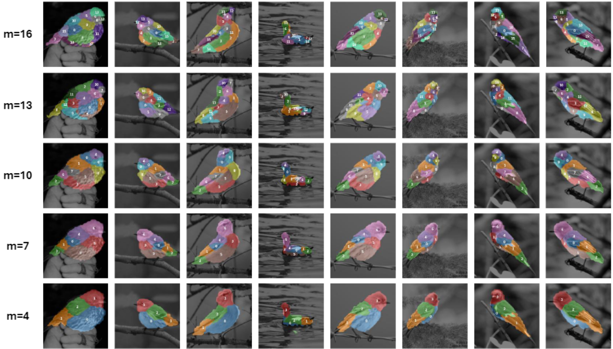

# Exploring Interpretability for Visual Prompt Tuning based on Part Prototypes


> **Exploring Interpretability for Visual Prompt Tuning based on Part Prototypes**
> [Yubin Wang](https://scholar.google.com/citations?user=mLeYNLoAAAAJ), [Xinyang Jiang](https://scholar.google.com/citations?user=JiTfWVMAAAAJ), [De Cheng](https://scholar.google.com/citations?user=180lASkAAAAJ),  Xiangqian Zhao,  [Zilong Wang](https://scholar.google.com/citations?user=gOaxHvMAAAAJ), [Dongsheng Li](https://scholar.google.com/citations?user=VNg5rA8AAAAJ), [Cairong Zhao](https://scholar.google.com/citations?user=z-XzWZcAAAAJ)


## ✨ Highlights


> **<p align="justify"> Abstract:** *Visual prompt tuning offers significant advantages for adapting pre-trained visual foundation models to specific tasks. However, current research provides limited insight into the interpretability of this approach, which is essential for enhancing AI reliability and enabling AI-driven knowledge discovery. In this paper, rather than learning abstract prompt embeddings, we propose a set of interpretable prompts within a part-prototype explanatory scheme. Each prompt is associated with a specific, human-understandable semantic concept that directly corresponds to a particular part of the image, making the model’s behavior more transparent and explainable. Specifically, we present Interpretable Visual Prompt Tuning (IVPT), the first framework to explore interpretability in visual prompt tuning using part prototypes. We introduce a novel hierarchical structure of part prototypes to explain the learned prompts at various network layers. These category-agnostic prototypes are leveraged to discover concept regions, from where we aggregate features to obtain interpretable prompts integrated for fine-tuning. We perform comprehensive qualitative and quantitative evaluations on fine-grained classification benchmarks following the part-prototype explanatory scheme to show superior interpretability and accuracy.* </p>

## :rocket: Contributions

- We propose a novel framework for interpretable visual prompt tuning that uses part prototypes as a bridge to connect learnable prompts with human-understandable visual concepts; 
- We introduce a hierarchical structure of part prototypes to explain prompts at multiple network layers while modeling their relationships in a fine-to-coarse alignment;
- We demonstrate the effectiveness of our approach through extensive qualitative and quantitative evaluations on fine-grained classification benchmarks. The results show improved interpretability and accuracy compared to both conventional visual prompt tuning methods and previous part-prototype-based methods.

## 🛠️ Installation 

To install the required packages, run the following command: ```conda env create -f environment.yml``` and ```conda activate ivpt```

## 🗂️ Data preparation
* Download the dataset (CUB_200_2011.tgz) from [here](https://www.vision.caltech.edu/datasets/cub_200_2011/).
* Unpack CUB_200_2011.tgz to the `datasets/` directory in this project (the path of CUB-200-2011 dataset will be `datasets/CUB_200_2011/`).
* Run `python utils/crop.py` to split the cropped images into training and test sets. The cropped training images will be in the directory `datasets/cub200_cropped/train_cropped/`, and the cropped test images will be in the directory `datasets/cub200_cropped/test_cropped/`.
* Run `python utils/img_aug.py --data_path /path/to/source_codes/datasets/cub200_cropped` to augment the training set. Note that `/path/to/source_codes/datasets/cub200_cropped` should be an absolute path. This will create an augmented training set in the following directory: `datasets/cub200_cropped/train_cropped_augmented/`.

## 🧪 Training and Evaluation
We use 4 NVIDIA RTX A6000 GPUs for training. Please refer to [INSTRUCTION.md](INSTRUCTION.md) for detailed instructions on the training command. 

Among them, `--n_pro` parameter specifies the prototype numbers at different layers. For example,  17,14,11,8,5 indicates 17 prototypes at the 9-th layer, 14 prototypes at the 10-th layer, 11 prototypes at the 11-th layer, 8 prototypes at the 12-th layer, and 5 prototypes for the final classification.

If you have a different number of GPUs for training, please modify `--nproc_per_node` parameter.

```sh
# model training
sh run_train.sh

# classification evaluation
sh run_test.sh

# interpretability evaluation
sh run_eval.sh
```

Our code currently implements only the CUB-200 dataset. To customize the dataset, modify the code in both the `load_dataset.py` and the file under `./data_sets` folder.

## :art:  Visualization

To visualize specific regions in images, uncomment lines 497 to 533 in `engine\distributed_trainer_ivpt.py` and run the command for classification evaluation. This code segment will generate two image folders: `./snapshot/results_hie_images` and `./snapshot/results_vis_images`. 

In `./snapshot/results_hie_images`, each folder contains images illustrating a visual concept associated with a specific prototype at a particular layer. Below are example images from various folders.

<p align="center">          </p>

In `./snapshot/results_vis_images`, each folder contains images illustrating the segmentation of part regions at a specific level of granularity, corresponding to a particular layer of the model using a certain number of prototypes. Below are example images from various folders.

<p align="center">     </p>

## 🔍 Citation

If you use our work, please consider citing:

```bibtex

```

## 📧 Contact
If you have any questions, please create an issue on this repository or contact us at wangyubin2018@tongji.edu.cn.

## 😃 Acknowledgments
Our code is based on [PdiscoFormer](https://github.com/ananthu-aniraj/pdiscoformer) repository. We thank the authors for releasing their code. If you use our model and code, please consider citing these works as well.